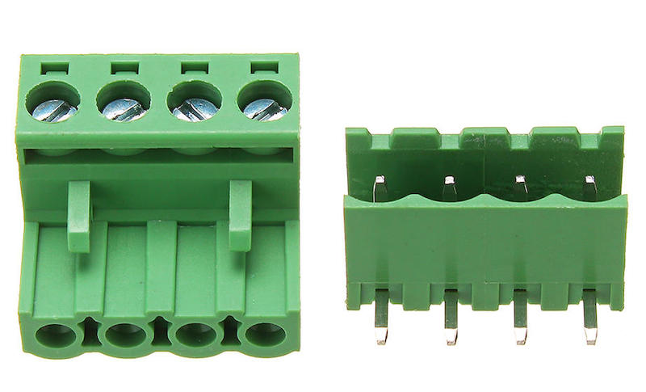

# AISVN Robot Platform

Platform standards for robot builds at AISVN

## Robot platform

This defines the location for the 4 mount points M3 to connect the drive unit to the control unit. The holes are 60 mm and 120 mm apart in rectangular shape. The spacer to the platform have a length of 35 mm to allow to mount the battery below the platform.

The interface to the motors is defined by a 4-pin 2EDG-5.08-4P-L connector. The left two pins connect to the left motor(s), the right two pins connect to the right motor(s). The outside pins are positive for the robot to move forward.

## Function drive()

A standardized software function that can be tailored to the used CPU and motor to be interchangeble if you switch bases or control units. The parameters should work both in Arduino C and in MicroPython.

## Remote interface

To control the robots we have a serial interface to receive signals from bluetooth or WiFi or even a cable controller that is interpredet by the control unit to drive the robot. Since there are many remote control apps available and even different bluetooth standards, we had to standardize the interface to work with this variety. And not all apps are available both on Android and iOS.

The protocol includes simple byte commands like 'F' for forward, 'L' for left, 'B' for backward and 'X' for stop.

## History

Back in 2017 we started to build our first remote controlled robots during club time at the AISVN. With ASA we've come a long way after that. Various projects required this standardisation to speed up the design process.

### T500

`2020/04/04`

[github.com/kreier/T500](https://github.com/kreier/T500)

The base has 3 motors with encoders and the robot is controlled by a raspberry Pi 3 with a 7" IPS screen and a camera with object detection. Might be upgraded to a NVIDIA Jetson Nano, but that's all future.

The 3 motors allow for driving in all directions simultanously without turning the robot around. Achieved in the beginning of 2020?

### T420

`2020/03/05`

Robot supercharged with AI: Object detection with camera, tensorflow, CUDA and openCV. Powered by a Nvidia Jetson Nano and output on a 7 inch 1024x600 IPS display. Took some time to get it going.

### T410

`2020/03/03`

Powered by a Raspberry Pi 1B with 3.5 inch 480x320 display for 80x25 characters at the terminal. 40 seconds to boot. [github.com/kreier/T410](https://github.com/kreier/T410)

### T400

`2020/02/02`

[github.com/kreier/T400](https://github.com/kreier/T400)

In session 3 for ASA this year we upgraded both motor unit and control unit. Now we have 12V DC motors that work much better with PWM and slow rpm. And it is controled by the much more powerful esp8266. With included WiFi. And we can program it with micropython. 

#### REPL
Another advantage: We now have REPL - the time from program instruction to execution is down to less than a second!

There is another T410 that is controlled by an Raspberry Pi 1. And a slightly larger T420 that is controlled by a NVIDIA Jetson Nano with 128 CUDA cores to run tensorflow for object detection, classification and other neural networks stuff.

### T300

`2019/10/10`

[github.com/kreier/T300](https://github.com/kreier/T300)

Our most ambitious project so far. For ASA session II we upgraded our robot car with a 4 DOF robot arm. The code had to be expanded as well. The total cost of all materials now sums to more that a million dong - or 45 dollars.

It also includes an ultrasonic sensor for distance now. This was backported to ASA as well.

### ASA robot

`2019/08/10`

https://github.com/kreier/asa

In ASA session I for 2019/2020 a total of 10 students signed up for our robotics and programming club. I created a list of desired materials and purcheased it for the students. After 9 weeks we had 6 working robots, controlled via bluetooth from the smartphones. And some students got into programming.

### T200

`2018/11/23`

https://github.com/kreier/T200

Now with PWM and controlled by an ESP32. The bluetooth connection is done by Bluetooth Low Energy (BLE) to be compatible with iOS and the many iPhones our students have.

The software used is https://apps.apple.com/us/app/goble-bluetooth-4-0-controller/id950937437 because it uses an analog control joystick for speed and direction. It required a reverse engineering of the protocol to make it compatable with the T200. In the end it worked!

### T110

`2018/10/13`

https://github.com/kreier/T110

Started in 2018 the robot should have been upgraded to Bluetooth 4.0 to work with iOS. This problem was easily solved by replacing the bluetooth module HC-05 with a AT-06 or anything with a CC2541 on it. Price is roughly the same.

Therefore this robot was upgraded with the remote for the PS2. The wireless editions are easy to get, to make it work consistenly unfortunatly not.

__Update 2019/09/25__ The control works, but looses connection all the time. Needs investigation!

### T100

`2018/03/26`

https://github.com/kreier/T100

To inspire the work for my bigger cohort of 21 students for the second semester 2017/2018 I created an example robot that was on display in our future Makerspace location.

And I created [a timelapse video](https://youtu.be/CzpAYpl62GI) to show how to build this robot in 30 seconds.

### Arduino Club 2017

`End of 2017`

When I started at AIS we had a weekly time slot of 30 minutes to work on a club of your choice. With 8 members we took our first steps in Arduino programming and blinking LEDs. Most ordered a Arduino Start Kit with breadboard, resitors, RFID (NFC), LEDs, capacitors and switches.

And we [tweeted](https://twitter.com/matthiashcmc/status/971250335628046337) about it.
