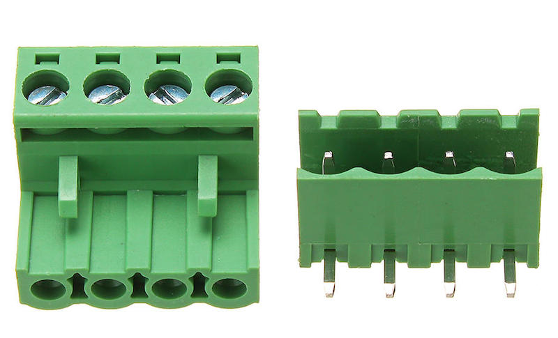

# Platform definition

This documents the location of the 4 connection points between the drivebase and the control unit as well as the two motor connectors.

## Physical connection

There are 4 points with M3 screws that connect the robot base with the control unit. The distances are the same for all robots from 2020 on. The distance is 60mm and 120mm in a rectangular shape. The holes itself are 4mm for the M3 screws to easier adjust for inaccurancies.

## Electrical connection

The interface to the motors is defined by a 4-pin 2EDG-5.08-4P-L connector. The left two pins connect to the left motor(s), the right two pins connect to the right motor(s). The outside pins are positive for the robot to move forward.

## Platform lasercut

For the T400 project we use a 210mm x 210mm platform to have a base for the robot arm, the esp8266 with motor control board, the i2c to servo controller board PCA9685, the 10000 mAh battery pack, the 2EDG-5.08-4P-L motor connector, the power on switch and the i2c/SPI OLED 1.3 inch display.
